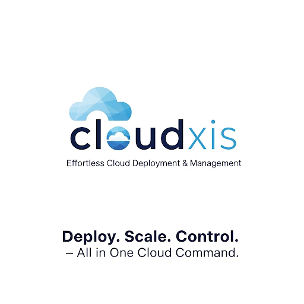

# cloudxis
Deploy. Scale. Control. – All in One Cloud Command

{: width="512" height="512"}

**Tagline:** *"Effortless Cloud Deployment & Management"*  

**Slogan:** *"Deploy. Scale. Control. – All in One Cloud Command."*  

## 🚀 **Short Description:**  
**Cloudxis** is your all-in-one cloud hosting & deployment toolkit, designed for developers and DevOps. Streamline your workflow with:  

- **🚀 One-Click Deployments** (Docker, Docker Compose, Images)  
- **⚡ Scaffold & Auto-Configure** Docker environments in seconds  
- **🛠️ CLI-Powered Control** – Run, Stop, Update servers with a single command  
- **☁️ Cloud-Optimized** for seamless scaling and management  

*"From localhost to production—Cloudxis bridges the gap."*  

💻 **`cloudxis deploy --fast --scale`**  
